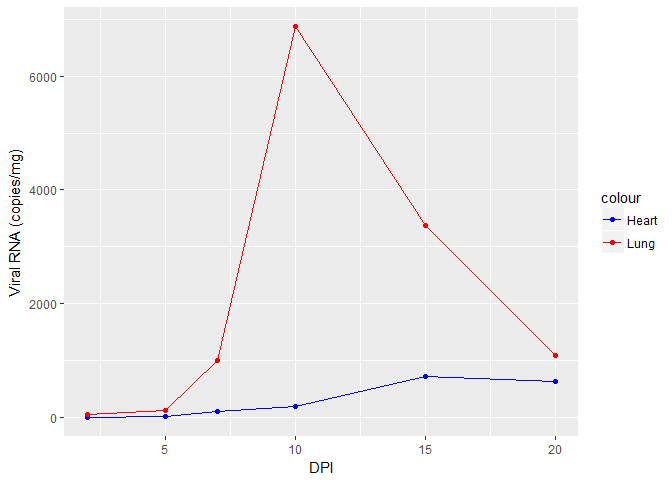

Introduction
============

Hantavirus is the causative agent of the emerging infectious disease, Hantavirus Pulmanry Syndrome (HPS). Rodents act as the reservoirs for the virus and the virus is spread to huumans when they come in contact with the extreta of infected rodents. One species of this virus namely Sin Nombre virus (SNV) uses the rodent, deer mouse (Peromuscus maniculatus) as its natural reservoir. When the virus infects its natural reservoir it causes a persistent infection that last for the lifetime of the individual where the virus replicates continously.

In this study, deer mice where infected with SNV in a longitudinal study to measure the number of virus that are present in the lungs and hearts of infected deer mice indiviuals. The aim of the study was to determine the viral load in infected individuals to see how the virus is able to keep replicating without being cleared by the infected individuals' immune system. It is know that the viruses target organ is the lungs but the study also wanted to see if the virus could be found in other parts of organs throught the body.

Methods
=======

Organs were harvested at day 2, 5, 7, 10, 15 days post infection (DPI). The viral load was determined by qRT-PCR and this value is expressed as viral copy numbers per mg organ weight.

To represent the results, I created a line graph with the DPI on the x-axis and viral copies/mg on the y-axis

``` r
library(ggplot2)

copy<- read.csv("../data/hanta_copies.csv")
copy.df<-data.frame(copy)

copy.result<- ggplot(copy.df)+
  geom_point(aes(x=DPI,y=Heart, color="Heart"))+
  geom_line(aes(x=DPI,y=Heart, color="Heart"))+
  geom_point(aes(x=DPI,y=Lung, color="Lung"))+
  geom_line(aes(x=DPI,y=Lung, color="Lung"))+
  xlab("DPI")+
  ylab("Viral RNA (copies/mg)")+
  scale_colour_manual(values=c("blue","red"))


print(copy.result)
```



``` r
copy<- read.csv("../data/hanta_copies.csv")
copy.df<-data.frame(copy)

print(copy.df)
```

    ##   DPI   Lung Heart
    ## 1   2   46.0   0.0
    ## 2   5  121.6   7.8
    ## 3   7  998.8 107.4
    ## 4  10 6867.4 187.4
    ## 5  15 3369.4 716.6
    ## 6  20 1086.2 635.0

Results/Discussion
==================

From figure one it can be seen that the lungs contained more viral copies when compared to copies found in the heart. The viral copies peaked at day 10 in the lungs and day 15 in the heart. After these peaks the copy numbers continue down in both organs, the lungs saw a more drastic decrease to the extent that it reach numbers equal to that found at day 7, the heart did not see such a sharp declinebut the number was lower than the peak
