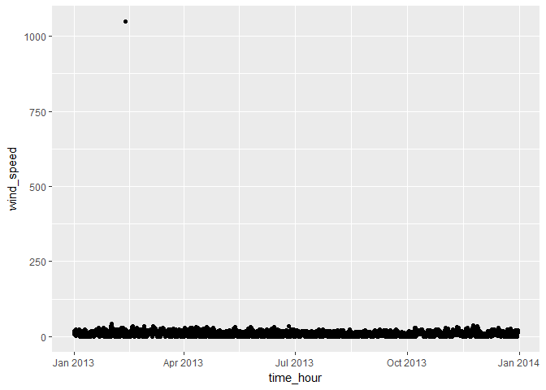
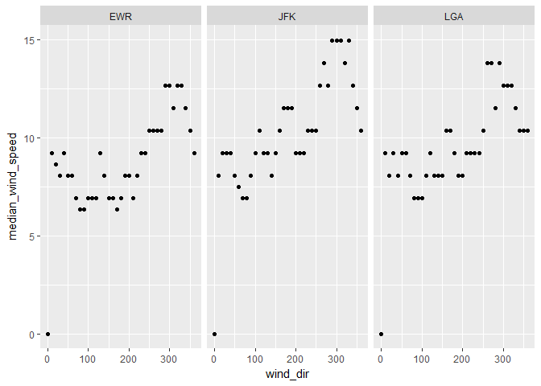
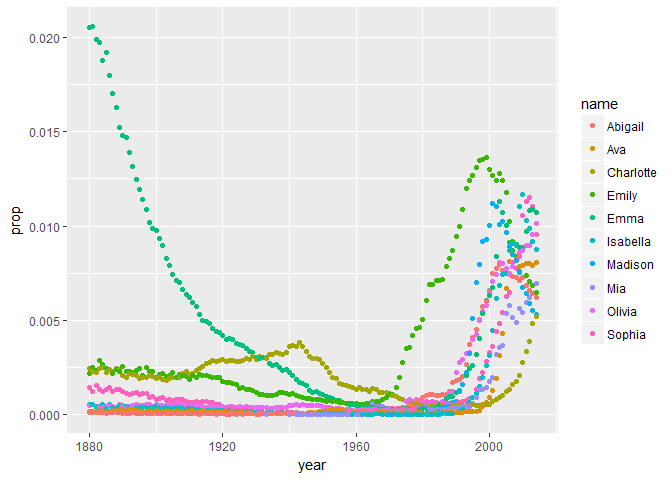
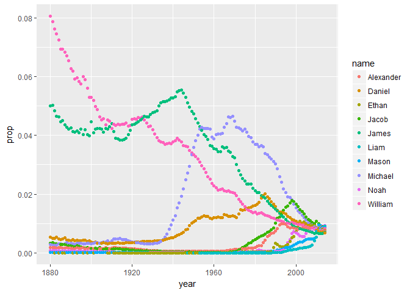

``` r
library(nycflights13)
```

    ## Warning: package 'nycflights13' was built under R version 3.3.3

``` r
library(tidyverse)
```

    ## Loading tidyverse: ggplot2
    ## Loading tidyverse: tibble
    ## Loading tidyverse: tidyr
    ## Loading tidyverse: readr
    ## Loading tidyverse: purrr
    ## Loading tidyverse: dplyr

    ## Warning: package 'ggplot2' was built under R version 3.3.3

    ## Warning: package 'dplyr' was built under R version 3.3.3

    ## Conflicts with tidy packages ----------------------------------------------

    ## filter(): dplyr, stats
    ## lag():    dplyr, stats

``` r
library(babynames)
library(ggplot2)
library(nasaweather)


weather.df<-nycflights13::weather
windspeed.df<- weather.df["wind_speed"]
flights.df<- nycflights13::flights
atmos_factors<-nasaweather::atmos


### Visual rep of data

ggplot(weather.df,
       aes(x=time_hour, y= wind_speed))+
  geom_point()
```

    ## Warning: Removed 3 rows containing missing values (geom_point).



``` r
### One data point stood out as an outlier as the speed was over 1200km/h

### filter point out by filtering windspeeds over 200

windspeed.df <- weather.df %>%
  group_by(wind_speed) %>%
  filter(wind_speed < 200)

  ### What direction has the highest median speed at each airport. 

  median_wind_speed <- weather.df %>% 
    na.omit(wind_dir)%>%                      ### removes N/A
    filter(wind_speed <250)%>% 
    group_by(origin, wind_dir)%>%
    summarise(median_wind_speed = median(wind_speed))%>%
    print()
```

    ## Source: local data frame [111 x 3]
    ## Groups: origin [?]
    ## 
    ##    origin wind_dir median_wind_speed
    ##     <chr>    <dbl>             <dbl>
    ## 1     EWR        0           0.00000
    ## 2     EWR       10           9.20624
    ## 3     EWR       20           8.63085
    ## 4     EWR       30           8.05546
    ## 5     EWR       40           9.20624
    ## 6     EWR       50           8.05546
    ## 7     EWR       60           8.05546
    ## 8     EWR       70           6.90468
    ## 9     EWR       80           6.32929
    ## 10    EWR       90           6.32929
    ## # ... with 101 more rows

``` r
### Plot of median wind speed at each airport
  
  ggplot(median_wind_speed, aes(x = wind_dir, y = median_wind_speed))+ 
    geom_point()+
    facet_wrap(~origin)
```



``` r
  ### Make a table with two columns: airline name and median distance flown from JFK airport.
  ### The table should be arranged in order of decreasing mean flight distance.
  
med_dist_flown<- flights.df %>% 
  inner_join(airlines)%>% 
  select(name, origin, distance)%>% 
  filter(origin=="JFK")%>% 
  group_by(name)%>% 
  arrange(desc(distance))%>% 
  summarise(median_dist_JFK = median(distance))%>%
  print()
```

    ## Joining, by = "carrier"

    ## # A tibble: 10 × 2
    ##                        name median_dist_JFK
    ##                       <chr>           <dbl>
    ## 1    American Airlines Inc.            1598
    ## 2      Delta Air Lines Inc.            1990
    ## 3         Endeavor Air Inc.             427
    ## 4                 Envoy Air             425
    ## 5  ExpressJet Airlines Inc.             228
    ## 6    Hawaiian Airlines Inc.            4983
    ## 7           JetBlue Airways            1028
    ## 8     United Air Lines Inc.            2586
    ## 9           US Airways Inc.             541
    ## 10           Virgin America            2475

``` r
### Make a wide-format data frame that displays the number of flights that 
### leave Newark ("EWR") airport each month,from each airline

ewr.df <- nycflights13::flights%>% 
  filter(origin == "EWR")%>% 
  left_join(airlines)%>%
  select(origin, month, name)%>%
  group_by(name, month)%>% 
  summarise(Flights = n())%>% 
  spread(month, Flights, fill = NA, convert = FALSE, drop = TRUE, sep = NULL)%>%
  print()
```

    ## Joining, by = "carrier"

    ## Source: local data frame [12 x 13]
    ## Groups: name [12]
    ## 
    ##                        name   `1`   `2`   `3`   `4`   `5`   `6`   `7`
    ## *                     <chr> <int> <int> <int> <int> <int> <int> <int>
    ## 1      Alaska Airlines Inc.    62    56    62    60    62    60    62
    ## 2    American Airlines Inc.   298   268   295   288   297   291   303
    ## 3      Delta Air Lines Inc.   279   249   319   364   377   347   340
    ## 4         Endeavor Air Inc.    82    75    91    88   103    88    94
    ## 5                 Envoy Air   212   196   228   220   226   218   228
    ## 6  ExpressJet Airlines Inc.  3838  3480  3996  3870  4039  3661  3747
    ## 7           JetBlue Airways   573   532   612   567   517   506   546
    ## 8     SkyWest Airlines Inc.    NA    NA    NA    NA    NA     2    NA
    ## 9    Southwest Airlines Co.   529   490   532   518   530   501   526
    ## 10    United Air Lines Inc.  3657  3433  3913  4025  3874  3931  4046
    ## 11          US Airways Inc.   363   328   372   361   381   390   402
    ## 12           Virgin America    NA    NA    NA   170   186   180   181
    ## # ... with 5 more variables: `8` <int>, `9` <int>, `10` <int>, `11` <int>,
    ## #   `12` <int>

``` r
### Identify the ten most common male and female names in 2014. 
### Make a plot of their frequency (prop) since 1880. 


bn<- babynames

### top 10 female names

top_female_names2014<-bn%>%
  filter(year==2014, sex=="F")%>%
  group_by(sex)%>%
  top_n(10,n)%>%
  print()
```

    ## Source: local data frame [10 x 5]
    ## Groups: sex [1]
    ## 
    ##     year   sex      name     n        prop
    ##    <dbl> <chr>     <chr> <int>       <dbl>
    ## 1   2014     F      Emma 20799 0.010729242
    ## 2   2014     F    Olivia 19674 0.010148906
    ## 3   2014     F    Sophia 18490 0.009538136
    ## 4   2014     F  Isabella 16950 0.008743721
    ## 5   2014     F       Ava 15586 0.008040096
    ## 6   2014     F       Mia 13442 0.006934106
    ## 7   2014     F     Emily 12562 0.006480155
    ## 8   2014     F   Abigail 11985 0.006182507
    ## 9   2014     F   Madison 10247 0.005285953
    ## 10  2014     F Charlotte 10048 0.005183298

``` r
### top  10 male names

top_male_names2014<-bn%>%
  filter(year==2014, sex=="M")%>%
  group_by(sex)%>%
  top_n(10,n)%>%
  print()
```

    ## Source: local data frame [10 x 5]
    ## Groups: sex [1]
    ## 
    ##     year   sex      name     n        prop
    ##    <dbl> <chr>     <chr> <int>       <dbl>
    ## 1   2014     M      Noah 19144 0.009431494
    ## 2   2014     M      Liam 18342 0.009036381
    ## 3   2014     M     Mason 17092 0.008420555
    ## 4   2014     M     Jacob 16712 0.008233344
    ## 5   2014     M   William 16687 0.008221027
    ## 6   2014     M     Ethan 15619 0.007694866
    ## 7   2014     M   Michael 15323 0.007549038
    ## 8   2014     M Alexander 15293 0.007534258
    ## 9   2014     M     James 14301 0.007045539
    ## 10  2014     M    Daniel 13829 0.006813003

``` r
### Make a plot of their frequency (prop) since 1880
 
  ### plot 10 female names ploted

    ###Determining the top names

female_names_plot <- bn %>%
  filter(sex == "F") %>%
  filter(name %in% top_female_names2014$name) %>%
  select(year,sex,name,prop) %>%
  group_by(name)

    ### PLoting the top names

ggplot(female_names_plot, 
       aes(x=year, y=prop, color=name))+
  geom_point()
```



``` r
### plot 10 male names ploted

    ###Determining the top names
male_names_plot <- babynames %>%
  filter(sex == "M") %>%
  filter(name %in% top_male_names2014$name) %>%
  select(year,sex,name,prop) %>%
  group_by(name)

### PLoting the top names

ggplot(male_names_plot, 
       aes(x=year, y=prop, color=name))+
         geom_point()
```



``` r
### Make a single table of the 26th through 29th most common girls names in the year 1896, 1942, and 2016

common<-bn%>%
  filter(year==1896 | year==1942 | year==2016, sex== "F" )%>%
  group_by(year)%>%
  top_n(29,prop)%>%
  top_n(-4,prop)%>%
  print()
```

    ## Source: local data frame [8 x 5]
    ## Groups: year [2]
    ## 
    ##    year   sex    name     n        prop
    ##   <dbl> <chr>   <chr> <int>       <dbl>
    ## 1  1896     F  Martha  2022 0.008023969
    ## 2  1896     F  Esther  1964 0.007793805
    ## 3  1896     F Frances  1964 0.007793805
    ## 4  1896     F   Edith  1932 0.007666819
    ## 5  1942     F   Helen 10014 0.007202575
    ## 6  1942     F Marilyn  9904 0.007123458
    ## 7  1942     F   Diane  9550 0.006868843
    ## 8  1942     F  Martha  9513 0.006842231

``` r
### I used the the nasaweather dataset and determined the average surface temperature
### and temp (dont really know what this is) during the month of January in the year 2000

head(nasaweather::atmos)
```

    ## # A tibble: 6 × 11
    ##        lat   long  year month surftemp  temp pressure ozone cloudlow
    ##      <dbl>  <dbl> <int> <int>    <dbl> <dbl>    <dbl> <dbl>    <dbl>
    ## 1 36.20000 -113.8  1995     1    272.7 272.1      835   304      7.5
    ## 2 33.70435 -113.8  1995     1    279.5 282.2      940   304     11.5
    ## 3 31.20870 -113.8  1995     1    284.7 285.2      960   298     16.5
    ## 4 28.71304 -113.8  1995     1    289.3 290.7      990   276     20.5
    ## 5 26.21739 -113.8  1995     1    292.2 292.7     1000   274     26.0
    ## 6 23.72174 -113.8  1995     1    294.1 293.6     1000   264     30.0
    ## # ... with 2 more variables: cloudmid <dbl>, cloudhigh <dbl>

``` r
delta_temp<-nasaweather::atmos%>%
  filter(year==2000, month==1)%>%
  summarise(mean(surftemp), mean(temp))
```
